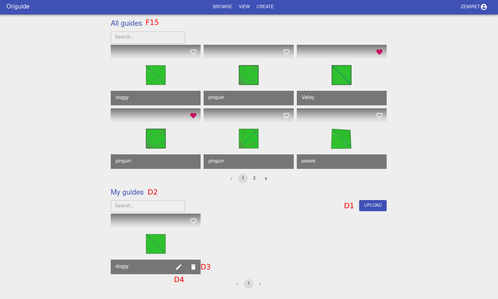
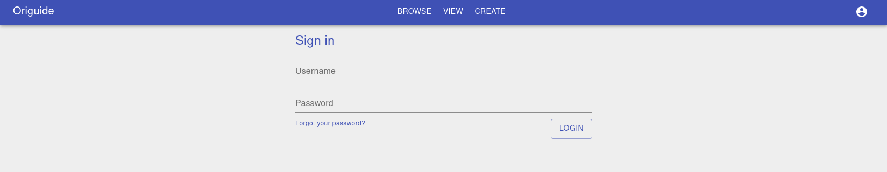

 {#sec:vision}

Problem characteristics
-----------------------

Origami has been around for a long time. It originated in China and
Japan and spread all around the world[@wiki:history-of-origami]. Origami
is recognized as the art of paper folding. Recently, it is becoming
increasingly popular in a scientific context. Although known for
centuries, it still exhibits properties that are useful in many
different contexts, e.g. space exploration[@origami-in-orbit], or
deploying solar arrays[@solar-panel-origami]. Mathematicians started
recognizing material folding as a distinct branch, known as . The field
has seen a tremendous development in the past couple decades especially
in the software space. Although dynamic, there are still many open
problems [@mit-open-problems]. Beginners fold origami following
step-by-step instructions. More advanced origamists will use a to form a
. The process of origami creation consists of two stages: *design* and
*folding*.

{width="80%"}

Motivation
----------

Even though origami seems to be a child's play, at times people would
get discouraged whilst following the origami instructions due to the
lack of details they expose.

We would like to provide a way for beginners (and advanced origamists
alike) to visualize step-by-step the folding process of the origami
pattern that they provide. While there exist some programs aiding the
process of design, there is no satisfactory solution that would present
the process of folding as it would be carried out manually.

We have evaluated existing solutions, and the one that resembles what we
would like to achieve the most [@origami-simulator] provides a way to
load a crease pattern and display the process of folding, however it
does not allow to visualize the process step-by-step, it only allows to
go from a flat sheet of paper to a folded state immediately. It also
bypasses some physical properties, such as the fact that the paper
should collide with itself.

{width="80%"}

Product Vision
--------------

### Functionality

Our main goal is to create a platform to visualize the origami model in
3D, in every step of the folding process, while animating the
transitions between the steps.

The inseparable component of the system would be a file format
describing the folding steps necessary to complete the origami.\
**The users would be able to:**

-   load the folding instruction

-   choose the step of the instruction that they want to visualize

-   rotate the scene

-   zoom in and out

-   move around the scene

-   pause the animation at any time, and move back and forth

### Technology

Our application will consist of two layers - backend and frontend.

Backend part will serve frontend pages, and be responsible for storing
user files.

Frontend part will handle user interaction, computations on the origami
model, 3D visualizations, and communication with backend.

We have decided to use well-known and tested technologies. For the
backend part, we are going to use *Go* language, using standard library
to write the server part.

For the frontend, we will use vanilla *JavaScript* for user interface
and computations, and we will perform 3D rendering using *Three.js*
library that is built on top of *WebGL*.

Feasibility Study
-----------------

Both *Go* and *JavaScript* are widely spread and actively maintained
languages. There is a strong community surrounding both of them.
*Three.js* is the most popular library for 3D *WebGL* rendering.

Therefore, we are not expecting problems connected with the tools we
have selected.

Since the project will require a lot of knowledge from the computational
origami field, we will have to research the existing materials on this
topic. The most promising resource seems to be a MIT course by Eric
Demaine [@mit-course], and a book co-authored by the same person -
Geometric Folding Algorithms[@origami-book]. Various papers are also
available which might come in handy, especially those regarding software
implementations.

Threat Assessment
-----------------

Playing with the intersection between reality and computer science has
always been a challenging task. Here, we are trying to tackle a problem
that has not been discussed previously. Every year the field of
computational origami sees a progress, so the mathematics behind it are
not yet well developed. We foresee many challenges along the way, such
as:

-   NP-hardness - some problems that we will face are in general proved
    to be NP-hard. Example of such a problem can be computing layer
    ordering based on a crease pattern. We will have to overcome them
    either using approximate methods, or coming up with solutions that
    will avoid them.

-   physical properties of a paper - if we would like to support complex
    physical properties, there is a lot of features that would require a
    separate set of computations simulating paper physics, e.g.

    -   inflating

    -   curving

    -   cutting

-   performance - web browser are still not well optimized to carry out
    3D computations and render 3D graphics in real time. The system will
    have to be highly optimized, in order to be usable. State of the art
    programs offload computational payload to GPU.

-   mathematics - we don't have a lot of experience in writing complex
    simulations utilizing complicated mathematical formulas. Even
    computing a simple paper fold requires physical computations such as
    computing strain on different parts of the paper.

-   3D graphics - we have some experience working with 3D, however only
    from the user perspective. We have little experience in creating 3D
    graphical software.

That all being said, we believe we are able to undertake this problem
and provide a solution to it. While challenging it is also rewarding in
terms of business value and as a unique product in the field.

Dictionary
----------

computational origami

:   [\[dictionary:computational-origami\]]{#dictionary:computational-origami
    label="dictionary:computational-origami"} - a recent branch of
    computer science studying efficient algorithms for solving
    paper-folding
    problems.[@recent-results-in-computational-origami:paper]

crease

:   \- a line segment on a paper.

crease pattern

:   [\[dictionary:crease-pattern\]]{#dictionary:crease-pattern
    label="dictionary:crease-pattern"} - a pattern of lines formed by
    creases that is created after unfolding the origami flat.

folded state

:   [\[dictionary:folded-state\]]{#dictionary:folded-state
    label="dictionary:folded-state"} - a sheet of paper folded along the
    crease pattern, an assembled origami model.

mountain

:   \- a fold of paper along the crease, such that the facets on the
    sides of the crease are facing downwards.

valley

:   \- a fold of paper along the crease, such that the facets on the
    sides of the crease are facing upwards.

mountain-valley assignment

:   \- an assignment of mountain or valley to the creases on the crease
    pattern.

.fold file

:   \- a file that conforms to the FOLD[@fold:paper] specification.

Instruction

:   \- a *.fold* file created by a user, representing a sequence of
    steps required to fold a sheet of paper into a complete origami
    figure.

Transition

:   \- a folding animation played between two steps.

Guide

:   \- a set of all Transitions derived from an Instruction.

Model

:   \- 3D representation of an origami figure.

FPS

:   \- frames per second.

 {#sec:functionality}

System actors
-------------

Based on the requirements analysis, we have two types of actors in our
system:

Folder

:   [\[actors:folder\]]{#actors:folder label="actors:folder"} - A person
    who carries out the most important functionality in our system, that
    is - folds the origami, based on the provided simulation. This
    person does not need to have any knowledge about origami creation
    nor the simulation process.

Designer

:   [\[actors:designer\]]{#actors:designer label="actors:designer"} - A
    person who is responsible for providing folding instructions for
    other users (folders). A Designer is required to have some basic
    knowledge about origami construction, and interaction with the
    system to be able to create and upload a guide. A Designer has to
    have an account.

Functional requirements {#section:functional-requirements}
-----------------------

We provide functional requirements to the system as User Stories divided
by actor type. They have a priority assigned to them from 1 to 3. Where:

1.  low priority - a feature that is nice to have, but not required

2.  medium priority - a feature that is important, but not essential for
    the system functionality

3.  high priority - a feature required for the system functionality

### Folder user stories

As a folder I am able to...

1.  load an Instruction. (3)

2.  view the 3D representation of the Instruction step. (3)

3.  switch to the next step in the Instruction. (3)

4.  switch to the previous step in the Instruction. (3)

5.  see the Transition between two Instruction steps. (3)

6.  pause the Transition at any time. (2)

7.  rewind the Transition. (2)

8.  forward the Transition. (2)

9.  rotate the Model in 3D space. (3)

10. zoom the Model in and out in 3D space. (3)

11. see creases of the Model. (1)

12. distinguish paper's top and bottom sides. (2)

13. change the color of the paper side. (1)

14. navigate between simulator and community views. (3)

15. view Instructions uploaded by other users. (3)

16. create an account. (3)

17. log into the system. (3)

18. reset the password. (3)

19. change the password. (2)

20. delete the account. (2)

21. save another user's Instruction in my account. (2)

22. mark a saved Instruction as folded. (1)

### Designer user stories

As a designer I am able to...

1.  upload an Instruction. (3)

2.  view my Instructions. (3)

3.  delete my Instructions. (3)

4.  update my Instructions. (3)

5.  mark my Instructions as public or private. (1)

6.  visually design an Instruction. (1)

7.  save a designed Instruction. (1)

Non-functional requirements
---------------------------

We have deduced the following non-functional requirements that our
system needs to fulfill in order to meet the client's expectations.

1.  Anyone with an up to date web browser is able to use the
    application. (3)

2.  The application must be reachable under a public address. (3)

3.  All system components can be run on separate machines. (1)

4.  Transitions should be played in at least 24 FPS on modern
    hardware. (2)

5.  User should be able to use the application on mobile devices. (1)

UI wireframes
-------------

Based on the requirements, we have created the following UI wireframes
that present the most important parts of our system.

{width="80%"}

{width="80%"}

 {#sec:implementation}

Prototype
---------

From the list of features mentioned in the previous chapter we have
selected the most important ones and created a prototype in a form of
MVP (Minimum Viable Product).

The selected features:

1.  load an Instruction. (3)

2.  view the 3D representation of the Instruction step. (3)

3.  switch to the next step in the Instruction. (3)

4.  switch to the previous step in the Instruction. (3)

5.  see the Transition between two Instruction steps. (3)

6.  pause the Transition at any time. (2)

7.  rewind the Transition. (2)

8.  forward the Transition. (2)

9.  rotate the Model in 3D space. (3)

10. zoom the Model in and out in 3D space. (3)

11. see creases of the Model. (1)

12. distinguish paper's top and bottom sides. (2)

Some of the listed functionalities require a numerical solver which is
also included in the MVP.

Both Instructions and Transitions are represented using .fold files
which we have extended with information required by the application.

### Frontend

At first we had decided to use plain *JavaScript* with the *Rollup*
bundler and *Three.js* framework. It quickly became apparent that the
lack of state management will become problematic as the development
progresses. Following that realization we have decided to incorporate a
reactive framework - *React* to aid the project with basic layout and
aforementioned state manipulation. Due to minor interoperability issues
the Rollup was also replaced with *Webpack*.

The quality assurance is achieved through the use of:

Code linter

:   \- EsLint

Code prettiefier

:   \- Prettier

Test Runner

:   \- Jest

Continuous integration

:   \- Github Actions

The implementation is continuously delivered to *Netlify* via Github
Actions.

{width="80%"}

### Backend

The current backend part is responsible for carrying out numerical
computations. It converts a provided Instruction into a set of
coordinates representing transitions between folding steps.\
The solver is based on the techniques presented in the publication by A.
Ghassaei.[@origami-simulator:paper].

The computational framework consists of the three most important forces,
that drive the folding process.

Beam force

:   \- responsible for preserving edge length

Face force

:   \- responsible for preserving the original face shape

Crease force

:   \- responsible for folding

Given the current vertices' positions, and the mountain-valley
assignment, the solver computes forces imposed on vertices, and
calculates their next position using the forward Euler integration.

An additional **damping force** is introduced to prevent solver from
high frequency oscilations, assuring numerical stability under most
conditions.\
The solver is implemented in *Python*, using *numpy* and *scipy*
libraries.

{width="80%"}

Project overview {#section:project-overview}
----------------

As a name for our project, we picked **Origuide**. We will use this code
name interchangeably with terms like *the system* or *the application*.

{width="\\textwidth"}

Origuide consists of the following layers:

Frontend

:   \- a component that handles all user interactions with the system.

Backend

:   \- a component responsible for:

    -   processing all user requests initiated on the Frontend

    -   managing persistent data

    -   authentication and authorization

    -   scheduling of Instruction processing

Guides to process

:   \- a task queue distributing guides to process among Solver workers

Solver worker

:   \- a component responsible for converting Instructions to Guides.

As we previously distinguished two types of users in the system, there
are two main success paths through the application.

{width="\\textwidth"}

The Designer's main objective is to create Guides. After uploading a
Crease Pattern, the Designer is required to provide instruction steps.
When an Instruction is saved it gets scheduled on a Task Queue and
processed by a Solver worker. Once processing is finished the Guide is
marked as solved in the database.

{width="\\textwidth"}

The Folder's main objective is to fold origami figures following steps
presented by the Application. After successfully retrieving a guide from
the Backend, the user is presented with a Guide Viewer.

Technology stack
----------------

### Frontend

-   The Application is built in *Javascript* using the *React*
    framework.

-   *Three.JS* is used to display 3D models.

-   Triangulation is done using *earcut*.

-   Parsing folds is aided by *fold*.

-   User Interface components come mainly from *Material-UI*.

-   *Webpack* is responsible for bundling, minimizing, and transpiling
    the source code.

-   Code style is checked using *Prettier* with *ESLint* and enforced on
    every commit using *Husky*.

-   *Jest* has been incorporated as a test runner.

Origuide is a web application. Hence, *Javascript* has been an obvious
choice. We have briefly considered *Typescript* as well, but have not
used it due to its more enforcing nature, which could have potentially
slowed down the development process. When it comes to 3D rendering
frameworks *Three.js* is one of the most mature and most frequently used
libraries for modern rendering targets such as *WebGL*. The decision to
use *Material-UI* has been made without much research on other tools,
which we later regretted. As previously mentioned, we have also
introduced *React* early in the process to aid us with state management
and organize the frontend application in a structurized manner. The
tools chosen for code and software quality assurance have been picked
based on our familiarity with them.

### Backend

-   Backend is built in *Python* using *Django* framework.

-   *DjangoRestFramework* simplifies a REST server setup.

-   *drf-base64* helps with decoding base64 encoded files.

-   *PyJWT* assists in authentication processes.

-   *factory-boy* is used to generate testing data.

-   Data is stored in a *PostgreSQL* database.

-   *Celery* was chosen for asynchronous task processing.

-   *Redis* acts as a task queue for *Celery*.

The Community backend technology stack has been chosen based on the
maturity of tools, perceived speed of iteration, and our prior
experience. *Django* is an opinionated framework, which provides a set
of sane default configuration for rapid prototyping and building of web
applications. Choosing it has enabled us to focus on the main product
instead of common security issues of HTTP servers, database access,
schema migrations, password policies, or mail sending. The rest of the
libraries used are strongly tied to the *Django* community and
recommendations.

### Solver

-   Solver runs under *Python*'s alternative implementation - *PyPy*.

-   *Shapely* is used for triangulation.

At first, Python was meant to be used only for building a proof of
concept to answer the question of whether implementing a solving library
on the backend, instead of the frontend, is a feasible solution for the
project. The question has been answered affirmatively, and at that
moment we were quite happy with the performance aspect. Unfortunately,
down the line, after loading more and more complicated Origami models it
became apparent that Python's native performance will not cut it. We
were worried that a whole rewrite in a more performant language is
imminent. After seeking an alternative solution, the fear has been
dispelled. The implementation has benefited from a ten-fold increase in
performance by using a performance-oriented Python implementation -
*PyPy*.

Components overview
-------------------

### Frontend

The web application contains two main subcomponents: *Guide Creator* and
*Guide Viewer*, responsible respectively for: creating instructions and
viewing animated guides. Other pages are mainly related to the community
aspect and will only be covered superficially in this section.

{width="\\textwidth"}

The web application has been structured in a way that encourages
building and reusing small components. An example would be a *Viewer*
component which is responsible for rendering origami figures and appears
in both *Guide Creator* and *Guide Viewer* pages. The structure has
allowed us to keep the code maintainable and implement changes quickly.

Data storage and manipulation are powered by three stores which store
data related to different aspects and functionality of the system.

-   The Creator store is responsible for storing an Instruction while it
    is being worked on.

-   The Player store stores information about the Guide while it is
    being viewed.

-   The Community store holds information regarding user sessions.

The application also contains a service responsible for communication
with the Community backend.

{width="70%"}

**Guide Creator**

Guide Creator is a frontend subcomponent allowing Designers to create
step-by-step Instructions from a crease pattern.

{width="\\textwidth"}

In the center one can see a loaded crease pattern with the edge
assignments reflecting the currently selected step. At the bottom an
interactive list of steps is shown.

To the right there is a set of configuration sections correspondingly
responsible for:

edge

:   \- Setting an edge target assignment or a fixed target angle.

step

:   \- Setting a step name and a description.

file

:   \- Setting an Instruction name and a description.

{#3-designer-creator-flow
width="\\textwidth"}

Until *Save the Guide* step, all data and user actions are handled on
the client-side. When *Save the Guide* action is invoked:

-   if a user is logged in, a request is sent to the Community backend
    with the whole configuration attached, or

-   a file download is initiated.

```{=html}
<!-- -->
```
    {
    	"private":false,
    	"guide_file":"data:text/json;base64,<base64 encoded guide>",
    	"thumbnail":"data:text/json;base64,<base64 thumbnail>"
    }
    	

    {
    	"id":6,
    	"owner":1,
    	"name":"penguin",
    	"published_at":"2020-12-01T18:49:18.131223Z",
    	"steps":9,
    	"guide_file":"https://api.<domain>/uploads/guides/file.fold",
    	"thumbnail_file":"https://api.<domain>/uploads/thumbnails/thumbnail.png",
    	"animation_file":null,
    	"status":"QUE",
    	"private":false,
    	"solved":false,
    	"liked":false,
    	"owner_username":"maciekmm1"
    }
    	

**Guide Viewer**

The purpose of the **Guide Viewer** is to show animated steps fluently.
It consists of a model, a list of steps, and playback controls.

{#3-guide-viewer width="\\textwidth"}

When a Guide is opened, the Guide Viewer fetches the `animation_file`
from the Community backend and renders it. The response conforms to the
same model as the aforementioned
([\[guide-response\]](#guide-response){reference-type="ref"
reference="guide-response"}) Guide creation response.

Playback controls allow rewinding, forwarding, stopping, and pausing.
Guide Viewer also provides functionality to load an arbitrary *.fold*
file by clicking the file icon located in the top-left corner of the
screen.

### Community backend

{#3-backend-community-components
width="\\textwidth"}

The Community backend is built using *Django*. It consists of a single
application - Community application - that is split into a couple of
subapplications:

-   Accounts

-   Guides

**Guides**

Guides is the main subapplication. It is responsible for handling Guide
creation, deletion, marking guides as favorites, and delegation of Guide
processing tasks.

Every action in the subapplication is performed in the context of a
Guide. The figure below ([4](#model--guide){reference-type="ref"
reference="model--guide"}) depicts the Guide model.

{#model--guide width="60%"}

The fields describe:

id

:   \- a handle for a particular Guide.

owner

:   \- the Designer who created a particular Guide.

animation_file

:   \- an Animated Guide, a set of Transitions.

guide_file

:   \- an Instruction, a set of Steps.

name

:   \- a name that is displayed on the website.

private

:   \- a flag indicating whether the guide is only visible for the
    `owner`.

published_at

:   \- the date on which a Guide was published.

status

:   \- the outcome of Instruction to Guide processing step.

steps

:   \- a number of steps in the Guide.

thumbnail_file

:   \- a preview of the figure.

All actions initiated by a user are passed through a REST API that
performs simple CRUD operations.

When a Guide is created or updated it is scheduled onto a task queue and
later assembled into an Animated Guide. The processing task invokes
Solver to calculate intermediate steps forming a smooth folding
animation.

Guide processing may terminate with 3 different outcomes.

-   An Instruction may be impossible to fold programmatically or
    realistically. It might occur that the solving algorithm never
    stops, consuming all available resources. To counteract, a hard
    timeout has been introduced after which the Guide is marked as timed
    out - `TMO`.

-   An Instruction file may be malformed or unprocessable, in such
    scenario the Guide is marked as errored - `ERR`.

-   Finally, a properly folded Instruction is marked as done - `DON`.
    The generated Animation file is persisted in the file system.

{width="80%"}

**Accounts**

Accounts subapplication's responsibilities include, but are not limited
to:

-   authentication

-   account creation

-   password resetting

-   password changing

To fulfill its duties, the Accounts subapplication exposes several REST
API endpoints. The data model is mostly derived from the built-in Django
User model, which increased the development speed considerably.

{width="\\textwidth"}

Algorithms
----------

### Solver

*Please note that most of the ideas in this section come from
[@origami-simulator:paper]*.

The input to the Solver is a *.fold* file containing an Instruction and
its output is a *.fold* file containing a Guide. Instruction, at its
simplest, is a set of vertices laying on a flat surface, and a set of
edge assignments in each step. The Solver's job is to output a resulting
Guide file which has all the information necessary to display a folding
animation - that is, all the vertex positions at each step in time.

**Triangulation**

The Solver works using only triangular faces. Therefore, before any
folding-algorithm can happen, it has to generate a mesh that only
consists of triangles.

As an input, we get a set of 3D points, but triangulation works only in
2D. Hence, at first we convert a set of 3D points to 2D by removing one
of the axes (the one which will not lead to degenerate faces if
possible). Then, 2D **Delaunay triangulation** is carried out (we used
*Shapely* library for that). The algorithm introduces new edges. These
edges are dynamically constrained to stay flat while folding.

There are cases, where the default triangulation will not be
satisfactory since we would like to preserve faces' concavity and the
algorithm always generates a convex polygon.

For such cases, we first compute a face's original hull. After the
triangulation we check whether the resulting triangles lay within the
original hull. If they do not, they are excluded from the triangulation
result.

**Axial constraints - beam force**

Axial constraints prevent stretching and compression of edges. Each edge
is modeled as a spring which length should be kept constant at each
iteration.

Before solving begins, the initial edge length $l_{0}$ is calculated.
Then, **Hooke's law** is used to calculate the beam force:

$$F_{l} = -k_{axial} * (l - l_{0})$$

where $l$ is the current edge length and $k_{axial}$ is a constant.

Before we apply the force to the vertices, first we need to convert it
to a vector $\pmb{F}_{beam}$ in a model's coordinate space. The
$\pmb{F}_{beam}$ is related to the vertices position $\pmb{p}$ by:

$$\pmb{F}_{beam} = -\nabla V(\pmb{p}) = -\frac{\partial V}{\partial \pmb{p}}$$

where V is the potential energy of the system. By the chain rule, we
get:

$$\label{solver:beam_force}
\pmb{F}_{beam} = -\frac{\partial V}{\partial l}\frac{\partial l}{\partial \pmb{p}} = F_{l}\frac{\partial l}{\partial \pmb{p}} = -k_{axial} * (l - l_{0})\frac{\partial l}{\partial \pmb{p}}$$

For the two vertices attached to the edge, we have:

$$\frac{\partial l}{\partial \pmb{p_{1}}} = -\pmb{\hat{\imath}}_{12}, \frac{\partial l}{\partial \pmb{p_{2}}} = \pmb{\hat{\imath}}_{12}$$

where

-   $\pmb{\hat{\imath}}_{12}$ is a unit vector from vertex 1 to vertex 2

-   $\pmb{p_{1}}$ is vertex 1 position

-   $\pmb{p_{2}}$ is vertex 2 position

Although axial stiffness $k_{axial}$ could be related to material
properties, we devised it experimentally.

All of this boils down to a few lines of code:

``` {.python language="Python"}
i12 = normalize(vector_from_to(edge.v1.pos, edge.v2.pos))
k_axial = CONFIG['AXIAL_STIFFNESS_EA'] / edge.l0
m = k_axial * (edge.length - edge.l0)
f1 = m * i12
edge.v1.set_force(ForceName.BEAM, f1)
edge.v2.set_force(ForceName.BEAM, -f1)
```

**Crease constraints - crease force**

With axial constraints we restrict the model to retain its shape while
folding. However, the main force that drives folding process is the
result of crease constraints.

We drive faces connected by an edge to fold towards some target fold
angle $\theta$. The angle $\theta$ is the supplement of the dihedral
angle between the two neighbouring triangular faces.

{#solver:crease_force_face
width=".6\\linewidth"}
[\[solver:crease_force_face\]]{#solver:crease_force_face
label="solver:crease_force_face"}

Crease constraints are modeled as linear-elastic torsional springs.
Therefore, similarly to equation
[\[solver:beam_force\]](#solver:beam_force){reference-type="eqref"
reference="solver:beam_force"}, crease constraints will apply forces to
the neighbouring vertices by:

$$\label{solver:crease_force}
	\pmb{F}_{crease} = -k_{crease}(\theta - \theta _{target})\frac{\partial \theta}{\partial \pmb{p}}$$

where:

-   $\pmb{F}_{crease}$ is a force applied to a vertex in a model's
    coordinate space

-   $k_{crease}$ is an edge folding stiffness (more on that below)

-   $\theta$ is the current angle between the two faces (strictly
    speaking, supplement of the dihedral angle between the faces)

-   $\theta _{target}$ is the desired angle between the two faces

In the implementation, there are 5 possible edge assignments:

1.  valley

2.  mountain

3.  flat

4.  boundary

5.  unknown

$k_{crease}$ depends on the edge type.

The following piece of code computes the correct $k_{crease}$:

``` {.python language="Python"}
if edge.assignment == EDGE_BOUNDARY:
   k_crease = 0 

if edge.assignment == EDGE_MOUNTAIN or edge.assignment == EDGE_VALLEY:
    k_crease = edge.l0 * CONFIG['FOLD_STIFFNESS']
elif edge.assignment == EDGE_FLAT or edge.assignment == EDGE_UNKNOWN:
    k_crease = edge.l0 * CONFIG['FACET_STIFFNESS']
else:
    raise RuntimeError("wrong face assignment: ", edge.assignment)
```

Let's introduce symbols:

-   $k_{fold} =$ `CONFIG['FOLD_STIFFNESS']`

-   $k_{facet} =$ `CONFIG['FACET_STIFFNESS']`

As one can notice, the stiffness will be proportional to the initial
edge length. The stiffness parameter is chosen so that
$k_{axial} \gg k_{fold}$.

Manipulating $k_{facet}$ influences how the material behaves. The
smaller it is the more it acts like a piece of fabric. The bigger it
gets the more it starts to resemble paper and then plastic or metal.

As well as $k_{crease}$, angle $\theta _{target}$ also depends on the
edge type:

$$\theta _{target} =
\begin{cases}
	< 0 & \quad \text{for a mountain crease}\\
	> 0 & \quad \text{for a valley crease}\\
	0 & \quad \text{otherwise}
\end{cases}$$

By default, the target angle will be one of: $\pi, -\pi, 0$, but the
provided Instruction can override the default target angle.

Finally, partial derivatives of $\theta$ with respect to $\pmb{p}$ are
given by:

$$\label{solver:crease_force1}
\frac{\partial \theta}{\partial \pmb{p}_1} = \frac{\pmb{n}_1}{h_1}$$

$$\label{solver:crease_force2}
\frac{\partial \theta}{\partial \pmb{p}_2} = \frac{\pmb{n}_2}{h_2}$$

$$\label{solver:crease_force3}
	\frac{\partial \theta}{\partial \pmb{p}_3} = \frac{-\cot{\alpha _{4,31}}}{\cot{\alpha _{3,14}} + \cot{\alpha _{4,31}}} \frac{\pmb{n}_1}{h_1} + \frac{-\cot{\alpha _{4,23}}}{\cot{\alpha _{3,42}} + \cot{\alpha _{4,23}}} \frac{\pmb{n}_2}{h_2}$$

$$\label{solver:crease_force4}
\frac{\partial \theta}{\partial \pmb{p}_4} = \frac{-\cot{\alpha _{3,14}}}{\cot{\alpha _{3,14}} + \cot{\alpha _{4,31}}} \frac{\pmb{n}_1}{h_1} + \frac{-\cot{\alpha _{3,42}}}{\cot{\alpha _{3,42}} + \cot{\alpha _{4,23}}} \frac{\pmb{n}_2}{h_2}$$

with all the symbols as marked on the figure
([5](#solver:crease_force_face){reference-type="ref"
reference="solver:crease_force_face"}).

The code for calculating crease force strictly follows the above
formulations with one slight addition - conditionally adding or
subtracting a full angle if the faces passed through each other. This
prevents neighbouring faces from interpenetrating while folding.

``` {.python}
diff = theta - edge.last_theta
if diff < -ANGLE_FLIP_THRESHOLD:
    diff += TWO_PI
elif diff > ANGLE_FLIP_THRESHOLD:
    diff -= TWO_PI
theta = edge.last_theta + diff
```

**Face constraints - face force**

While not strictly necessary, face constraints add an additional layer
of stability to the solving process. The face constraints are meant to
keep interior angles of a face constant during the folding process.

{width=".6\\linewidth"}

As previously, face constraints are modeled as a linear-elastic spring.
For each of the interior angle of a triangular face, forces are applied
to its neighbouring vertices.

$$\label{solver:face_force}
	\pmb{F}_{face} = -k_{face}(\alpha - \alpha _0)\frac{\partial \alpha}{\partial \pmb{p}}$$

where

-   $k_{face}$ is a face stiffness

-   $\alpha$ is a current interior angle

-   $\alpha _0$ is an initial interior angle

Derivatives of $\alpha$ with respect to $p$ are given by

$$\label{solver:face_force1}
	\frac{\partial \alpha _{2,31}}{\partial \pmb{p}_1} = \frac{\pmb{n} \times (\pmb{p}_1 - \pmb{p}_2)}{\|\pmb{p}_1 - \pmb{p}_2\|^2}$$

$$\label{solver:face_force2}
	\frac{\partial \alpha _{2,31}}{\partial \pmb{p}_2} = \frac{\pmb{n} \times (\pmb{p}_1 - \pmb{p}_2)}{\|\pmb{p}_1 - \pmb{p}_2\|^2} + \frac{\pmb{n} \times (\pmb{p}_3 - \pmb{p}_2)}{\|\pmb{p}_3 - \pmb{p}_2\|^2}$$

$$\label{solver:face_force3}
	\frac{\partial \alpha _{2,31}}{\partial \pmb{p}_3} = \frac{\pmb{n} \times (\pmb{p}_3 - \pmb{p}_2)}{\|\pmb{p}_3 - \pmb{p}_2\|^2}$$

**Damping - damping force**

Damping is an additional force that is not required from the modeling
perspective, but is required from the solver's stability point of view.
It prevents model's oscillation while folding and without it barely any
model folds correctly.

{width=".4\\linewidth"}

Damping force is defined in terms of vertices' velocity as:

$$F_{damping} = -e_{damping} * (V_1 - V_2)$$

where:

-   $e_{damping}$ is a damping coefficient

-   $V_1$ and $V_2$ are vertices' velocities

For each edge damping coefficient is set as:

$$e_{damping} = d_p * 2 * \sqrt{k_{axial} * min(v1_{mass}, v2_{mass})}$$

where:

-   $d_p$ is a configurable damping percent

-   $k_{axial}$ is axial stiffness defined previously

-   $vx_{mass}$ is mass of a vertex $x$

We assume that mass is constant for each vertex.

As is the case for beam force, damping force is computed in a model's
coordinate space and then applied to each of the edge's vertices.

``` {.python}
delta_v = edge.v2.velocity - edge.v1.velocity
damping_force = edge.damping_coeff * delta_v
edge.v1.set_force(ForceName.DAMPING, damping_force)
edge.v2.set_force(ForceName.DAMPING, -damping_force)
```

**Numerical integration**

Once all the forces are defined, the total force for each vertex is
computed as a sum of all the imposed forces.

$$\label{solver:total_force}
	\pmb{F}_{total} = \sum_{edges} \pmb{F}_{beam} + \sum_{edges} \pmb{F}_{crease} + \sum_{faces}\pmb{F}_{face} + \sum_{edges}\pmb{F}_{damping}$$

Then using Newton's Second Law of Dynamics we compute acceleration as:

$$\pmb{a} = \frac{\pmb{F}_{total}}{m}$$

where $m$ is a vertex's mass. We assumed that mass is constant for each
vertex, however a more appropriate analysis could yield better results
in terms of folding dynamics.

Having acceleration, we compute vertex velocity and next position using
*forward Euler Integration* method:

$$\begin{aligned}
\pmb{V}_{t+\Delta t} = \pmb{V}_t + \pmb{a}\Delta t \\
\pmb{p}_{t+\Delta t} = \pmb{p}_t + \pmb{V}\Delta t
\end{aligned}$$

We assume the initial conditions:

$$\begin{aligned}
		\pmb{V}_0 = 0\\
		\pmb{p}_0 = \text{provided by Instruction}
	\end{aligned}$$

As an end condition we check whether the difference between current and
previous forces is smaller than some configured $\varepsilon$:

``` {.python language="Python"}
diff = np.abs(np.array(current_forces) - np.array(previous_forces))
return np.all(diff <= epsilon)
```

To generate all the Transitions in the model we run the solve function
for each step in the Instruction.

``` {.python}
for step in Instruction.steps:
    solve(step.vertices, step.target_angles)


def solve(vertices, target_angles):
    cur_forces = set_forces()
    set_target_angles(target_angles)

    while not finished:
        for (v, total_force) in zip(vertices, cur_forces):
            node_mass = v.mass
            v_t = v.velocity
            p_t = v.pos
            a = total_force / node_mass
            v_next = v_t + a * d_t
            v.pos = p_t + v_next * d_t
            v.velocity = v_next

        prev_forces = cur_forces.copy()
        cur_forces = set_forces()
```

Quality assurance
-----------------

To ensure the quality of the application, the codebase is continuously
linted, tested, built, and delivered. Immediate feedback is available
for developers, code reviewers, and operators, reducing the possibility
of merging a faulty code into the `master` branch and therefore using a
faulty deployment in the production environment.

The pipeline is implemented using *Github Actions*, which is a part of
*Github*. This allows for seamless integration with the code repository.

Furthermore, no changes can be pushed directly to the `master` branch.
Every commit needs to be reviewed by at least one other developer before
being merged. This policy is enforced using *Github* settings.

Each system component has a dedicated pipeline, tailored to specific
requirements.

Continuous delivery and deployment negate the risk of deploying an
application that has not passed all the required checks in the
pipelines.

All of the dependencies are bound to a specific minor version. Doing so
ensures that in case one of the vendors implements a breaking change our
application and pipelines will not break.

### Frontend

The frontend code is linted on every commit using *Husky*, *ESLint*, and
*Prettier*. It is not possible to push an incorrectly formatted code to
the repository. Uniformly formatted code improves the clarity, allowing
a code reviewer to focus on business logic and potential bugs instead of
code-formatting.

To aid the code review process every pull request containing changes
related to the frontend component is deployed as a *preview application*
on *Netlify*. A *preview application* is an isolated environment with an
application built using the code submitted along with a pull request.

Most of the business logic on the frontend is tested. The test runner of
choice is *Jest*. Running the whole test suite is as simple as executing
`yarn test`.

{width="\\textwidth"}

### Solver

Solver is a library written in *Python* and tested using the *unittest*
module. Most of the business logic is covered.

The line test coverage is 77%.

{width="80%"}

### Community

The Community backend is written in *Python* using *Django* and
therefore uses the *unittest* module that is built-in to the Python
standard library. All of the public-facing endpoints are fully covered
with integration tests verifying that authentication, authorization, and
request body handling are properly implemented. The line test coverage
is 96%.

Code style abides by the *PEP8* standard.

To ensure build reproducibility, the Community backend is enclosed in a
Docker image that is automatically deployed to a production environment.

{width="\\textwidth"}

Deployment
----------

Origuide uses *Docker* images for packaging backend components. Images
are pushed to the *Docker Hub* repository where they are publicly
available. The frontend build output consists of a set of static files.

The backend deployment configuration is specified using *docker-compose*
files. Because all the environment specific configuration is
externalized to `.env` files, the deployment configuration remains
environment agnostic. This makes Origuide's backend deployable using a
single command.

    DEBUG=false
    SECRET_KEY=invalid-secret-key

    EMAIL_HOST=localhost
    EMAIL_HOST_PASSWORD=localhost
    EMAIL_HOST_USER=user
    EMAIL_PORT=1025
    EMAIL_USE_TLS=false

    DATABASE_USER=origuide
    DATABASE_PASSWORD=password
    FRONTEND_DOMAIN=https://origami.wtf/

    docker-compose up -d
    	

The frontend component can be easily deployed to any file hosting
solution using a file transfer with no additional configuration
requirement. This configuration-less nature of the deployment allows
switching hosting providers easily should a need arise.

    scp -r ./dist user@{hosting-provider}:/www 
    	

**Production environment**

The backend production environment is running on servers provided by
*Digital Ocean*.

The frontend is built and deployed on *Netlify*.

Problems encountered
--------------------

### Collision detection and handling

### Damping force

### Paper stiffness

### Unnatural guide encoding

### Mesh rendering hazard

When folding origami models, two faces lying flat on each other are a
common occurrence.

The Solving algorithm is not sophisticated enough to have a sense of
sheet thickness. Therefore, it places the folded faces close to each
other, on the verge of numerical error. The rendering engine cannot
distinguish which face is on top and which one is below, resulting in a
face color mixture demonstrated below.

{width="60%"}

Unfortunately, the issue has not been resolved in the current iteration.
Some potential solutions include:

-   preventing faces from colliding during solving,

-   detecting interpenetrating faces after solving and marking which one
    is on top.

### Large web application bundle size

The frontend application uses multiple feature-rich libraries of
significant file size footprint such as *Three.js* or *Material-UI*. The
whole bundle size was $6.81\mathrm{MB}$ resulting in a non-ideal
download and parsing times of several seconds.

To analyze the size of all bundle components, *BundleAnalyzerPlugin* for
*Webpack* was used.

{width="\\textwidth"}

To optimize the application size several techniques have been used:

tree-shaking

:   \- dead code elimination technique

minimizing

:   \- unnecessary character removal

chunking

:   \- code splitting and on-demand chunk loading

The minimizing was done using the *Terser* plugin. Chunk splitting and
tree-shaking features are included, but not enabled by default, in
*Webpack*.

[\[bundle-size-optimizations\]]{#bundle-size-optimizations
label="bundle-size-optimizations"}

::: {#bundle-size-optimizations}
                     Before optimizations              After optimizations   
  ------------------ ---------------------- ---------- --------------------- ----------
                     Size                   Gzipped    Size                  Gzipped
  Three.js           1.2MB                  233.82KB   624.87KB              148.83KB
  Material-UI        701.28KB               122.62KB   196.81KB              56.33KB
  Application size   6.81MB                 1.52MB     1.2MB                 322.15KB
  Load time          4.24s                             0.81s                 

  : Incorporating optimizations reduced the bundle size massively,
  cutting the load time by a large factor.
:::

### Generating thumbnails for computed Guides

As of now, Guide thumbnails represent a flat crease pattern. Ideally,
the Guide's image would contain a fully folded model. The functionality
is not trivial to implement and, due to other issues having a higher
priority, has not been worked on.

{width="30%"}

A couple of potential implementations include:

-   Capturing a generated model on the first model view (that is how a
    crease pattern preview is currently implemented).

-   Spinning up a headless browser instance, loading a model, and making
    a screenshot.

-   Rendering a final solver step on the Solver backend using a plotting
    library.

 {#sec:organizacja-pracy}

Project characteristics
-----------------------

Our projects is special for a few reasons.

First of all, we came up with a project idea ourselves and tried to find
a person that would be interested in being a thesis supervisor. Taking
that into account, the requirements for the project were not defined
beforehand and we learned more and more about them as the project
developed. Due to that fact, it was both easier and harder for us to do
our job as architects and developers. On the one hand, it was mostly us
who were responsible for the direction the project would take, but at
the same time, at each step of the process we had to struggle with
choosing which parts of the project would be more attractive for our
client, our future users, and from the scientific point of view.

Second of all, some of the problems we were faced with come from the
field of *Computational Origami*. It's a relatively new branch of
science, which ideas span the realms of mathematics, physics, computer
science, engineering, and even architecture. Also, it is not a subject
that would normally be taught during one's educational career. Of much
help to us was Prof. Erik Demaine and his MIT course on Geometric
Folding Algorithms: Linkages, Origami, Polyhedra [@mit-course]

Taking into consideration all the facts mentioned above, our work did
not have a specifically structured approach. We were working in a very
simplified **Kanban** method, where we would select things to work on as
the project unfolded.

For the better part of the first semester, we were creating a prototype
that would serve as a *Minimal Valuable Product*. Later on, we did not
discard it altogether, but started adding more features on top of it,
polishing it and refactoring when necessary. We continued with this
approach till the end.

Team
----

Our team consisted of our thesis supervisor and us.

1.  **Witold Alda** - thesis supervisor.

2.  **Maciej Mionskowski** - developer, architect.

3.  **Antoni Mleczko** - developer, architect.

Responsibilities in the team
----------------------------

Although we were distributing workload equally between the team members
and each of us touched on all parts of the project, some areas received
more attention from one person than the other. To be able to define how
much of a percentage each one of us has contributed to the given area of
the project, first we need to define those areas.

Project areas:

-   Solver backend

-   Frontend

-   Community backend

-   DevOps / Infrastructure

-   Thesis

-   Research

-   Requirements formulation

Having defined project areas, we have agreed upon how much of a
contribution each of us has provided to the given area.

{width="\\textwidth"}

{width="\\textwidth"}

Organization of work
--------------------

### Tools

*Github* was our provider of choice for hosting the code repository,
planning work, incorporating continuous integration, continuous
delivery, and tracking progress. Despite some of the project management
and CI related features on Github being relatively new and simple, they
were suitable enough for our needs. Using the same service for managing
all project aspects allows for natural cross-referencing between issues
and code. It also acts as a single source of truth, hence reducing the
hassle associated with jumping between platforms and keeping them
synchronized.

For creating diagrams we used *diagrams.net* (formerly draw.io),
*canva.com*, and *TikZ*. *GIMP* was used for editing screenshots and
graphics. System mock-ups were designed in *Adobe XD*.

### Work methodology

Our work methodology was simple, agile, and based on the Kanban system.

We used multiple Github project boards to incorporate Kanban into our
environment. Community Backend, Solver Backend, Thesis, and
Infrastructure each received their separate Kanban Boards. Every Board
could represent a separate team working on the project.

{width="\\textwidth"}

We would pick issues to work on by moving a card from the **To Do** to
the **In progress** column. Once the development was finished and ready
for a review, a Pull Request would be created and the card would be
marked as **Review in progress**. Should a feature pass the review
process, the card would be moved to the **Done** lane.

After we established all functional requirements, they acted as our
guide for creating issues. Feature's priority impacted the position of
the card in the **To Do** column. The more important the feature was,
the higher it appeared on the **To Do** pane.

### Communication

**Internal**

Thanks to all development team members working from the same place, most
of the communication was carried out face to face. This fact had a
positive impact on the project as ideas were communicated clearly and
quickly. Non-urgent matters were handled through Github issues.

**External**

E-mail was used as the main mean of information exchange between the
developer team and the thesis supervisor. Occasionally, phone calls and
*Microsoft Teams* were used when a longer discussion was needed. The
communication was established primarily in situations when we wanted to
confirm a path the project is heading.

### Code development

As a version control framework we used a simplified *Git workflow*. Each
feature would be first developed on a feature branch. Once the work was
finished, a Pull Request would be created. The Pipeline would run tests
against the changed components. Should the pipeline pass, the review
process would commence. Once the work was successfully reviewed, the
`master` branch would be rebased onto the feature branch to avoid merge
conflicts. The Pull Request would then be squashed and merged into the
`master` branch. The main branch would run the Pipeline with an
additional delivery step, which would result in the code being published
to the production environment.

Project timeline
----------------

The idea for the project was born in Februrary 2020, during a
brainstorming session. The project began in March 2020 and was finalized
in December 2020.

The general overview of the project timeline can be presented in four
phases:

1.  **Brainstorming**, during which we held a couple of brainstorming
    sessions and came up with a few dozen of project ideas.

2.  **Idea Formalization**, in the midst of which we looked for a
    supervisor.

3.  **Topic Research**, throughout which we gathered required scientific
    knowledge.

4.  **Development**, during which we developed an actual product.

The diagram below depicts the estimated phase lengths during the project
time frame.

[\[4-project-phases\]]{#4-project-phases label="4-project-phases"}

{#4-project-phases
width="\\textwidth"}

To see how different aspects of the project unfolded, a more detailed
graphic has been created. The data has been mostly sourced from the
project's code repository.

[\[04-component-timeline\]]{#04-component-timeline
label="04-component-timeline"}

{#04-component-timeline
width="101%"}

As can be seen, the work has been pretty well planned and thought out.
The actual development time spans the whole project time frame.

The figure below presents the estimated intensity of work.

[\[04-commit-intensity\]]{#04-commit-intensity
label="04-commit-intensity"}

{#04-commit-intensity
width="101%"}

The more detailed monthly breakdown of the project state, with features
on which we worked, is listed below.

### March

At the beginning of March we were looking for a supervisor, formulating
problems, and planning the project.

Having all the formal issues sorted out, we started the Topic Research
phase.

Most of the time was spent on studying the *Geometric folding
algorithms: Linkages, Origami, Polyhedra* course[@mit-course]. The
videos provided us with knowledge concerning the scientific field of
computational origami, and most importantly:

-   the terminology,

-   current numerical algorithms for paper solving problems,

-   on-going research,

-   a file format for saving crease patterns,

-   pitfalls to avoid.

It is hard to imagine this project coming to fruition without getting
familiar with the aforementioned course.

### April

April was the start of the Development phase.

We started prototyping, in parallel, the following components:

-   the Guide Viewer

-   the Solver.

Most notable features that were completed in April include:

-   adapting the *.fold* file specification to suit the project needs,

-   *.fold* file parsing on both the backend and the frontend,

-   *.fold* file rendering on the frontend,

-   the frontend deployment pipeline,

-   triangulation on the backend.

The end of April resulted in first prototypes being previewed and
discussed. Our vision of the project was materializing.

[\[04-first-prototypes\]]{#04-first-prototypes
label="04-first-prototypes"}

{#04-first-prototypes width="101%"}

### May

During May we refactored the prototype that was developed in April. We
adjusted our technology choices and introduced testing libraries.

The most notable aspects that were completed in May include:

-   first working prototype of the Solver

-   incorporation of the React framework into the frontend,

-   the first chapter of the thesis.

### June

The main topic for May and June was the second chapter of the thesis.
The prototype section was written during that time.

### July

July was not a fruitful month for the project. Several discussions were
held, but no actual progress was made.

### August

In August our focus shifted to performance and stability aspects of the
system.

The most important matters that were wrapped up in August consist of:

-   adding a damping force to the Solver,

-   switching the Solver's runtime environment to PyPy,

-   adding Continuous Integration to the Solver,

-   supporting target angles in the Solver,

-   displaying edges with their assignment on the model,

-   adding timeline scrubbing to the Guide Viewer.

### September

September was a productive time, which brought a lot of business value
to the application.

This time we undertook the implementation of Guide Creator and Community
backend parts of the system. We accomplished:

-   smooth animations with an addition of Guide encoding,

-   a possibility to compose and create Guides intuitively using the
    Guide Creator,

### October

In October, we continued working on the community aspect of the system.

The most valuable features completed in October include:

-   option to create an account,

-   ability to log in,

-   Guide upload functionality,

-   password reset form,

-   ability to like a Guide,

-   Guides Browser,

-   support for 2D crease patterns.

### November

At the beginning of November, we had an application with almost all
functional requirements covered. It needed some tweaking, mainly from
the User Experience and User Interface points of view. The deadline was
nigh. Therefore, we focused all our attention on wrapping up the
development process and gaining momentum on writing the paper.

We have:

-   eliminated most of the major pain points from the system,

-   added Guide deleting and updating functionalities,

-   widened crease pattern support by changing the triangulation
    algorithm,

-   improved visual aspects of the system.

### December

As stated previously, in December we buckled down to writing the thesis
and fulfilling formal requirements.

 {#sec:wyniki-projektu}

Summary of product functionality
--------------------------------

In the section we have defined Folder's and Designer's user stories and
assigned priorities to them. All the requirements of priority 3 (high)
have been realized. Almost all the requirements of priority 2 (medium)
have been resolved. And most of the requirements of priority 1 (low)
have been addressed as well.

In this section we have reviewed the covered functionality from the end
user's perspective using screenshots of the end product. Each section
presents some part of the application and lists user stories that are
addressed in a given view. Overlaid on the screenshots are markers that
describe which functionality is addressed in which part of the UI. The
format of each marker is $NX$, where $N$ is a letter - either $F$ or $D$
depicting whether the highlighted part of the UI corresponds to a
**F**older's user story or a **D**esigner's user story. And $X$
represents user story's sequence number, assigned to it previously in
the section .

### Guide Viewer

Folder's user stories:

1.  load an Instruction. (3)

2.  view the 3D representation of the Instruction step. (3)

3.  switch to the next step in the Instruction. (3)

4.  switch to the previous step in the Instruction. (3)

5.  see the Transition between two Instruction steps. (3)

6.  pause the Transition at any time. (2)

7.  rewind the Transition. (2)

8.  forward the Transition. (2)

9.  rotate the Model in 3D space. (3)

10. zoom the Model in and out in 3D space. (3)

11. see creases of the Model. (1)

12. distinguish paper's top and bottom sides. (2)

13. navigate between simulator and community views. (3)

{width="\\textwidth"}

### Guide Browser

Folder's user stories:

15. view Instructions uploaded by other users. (3)

Designer's user stories:

1.  upload an Instruction. (3)

2.  view my Instructions. (3)

3.  delete my Instructions. (3)

4.  update my Instructions. (3)

{width="\\textwidth"}

### Guide Creator

Designer's user stories:

5.  mark my Instructions as public or private. (1)

6.  visually design an Instruction. (1)

7.  save a designed Instruction. (1)

{width="\\textwidth"}

### Sign up

Folder's user stories:

16. create an account. (3)

{width="\\textwidth"}

### Sign in

Folder's user stories:

17. log into the system. (3)

{width="\\textwidth"}

### Reset password

Folder's user stories:

18. reset the password. (3)

{width="\\textwidth"}

Once the form is submitted, the user receives an email containing
password reset instructions.

{width="\\textwidth"}

### Change password

Folder's user stories:

19. change the password. (2)

{width="\\textwidth"}

### Functional requirements that have not been realized

There are some functional requirements that have not been realized. All
of them happen to be Folder's user stories. Some proved to be not as
important as we assumed initially. There are also some that have been
only partially accomplished, e.g. they are implemented in the backend
but no corresponding frontend option is present.

Not realized or partially realized functional requirements:

13. change the color of the paper side. (1)

14. delete the account. (2)

15. save another user's Instruction in my account. (2)

16. mark a saved Instruction as folded. (1)

### Non-functional requirements

All but one non-functional requirements have been realized.

The not realized requirement is:

5.  User should be able to use the application on mobile devices. (1)

Although some parts of our application are usable on mobile devices, not
everything works as intended. That is not surprising taking into account
that mobile application support had a low priority.

Main use cases
--------------

As defined in the section , there are 2 main success paths in the
application. One for Designers and another one for Folders. These
success paths correspond to the main use cases. In this section we will
present these success paths in the context of the end product.

### Designer's success path

First, the user loads a crease pattern.

{width="\\textwidth"}

Next, the creator view is shown, and the user proceeds with creating an
Instruction. Once done, the user clicks the *save* button.

{width="\\textwidth"}

Proper requests are dispatched to the backend, the guide is processed in
the background, and the user is redirected to the Guide Browser view.

{width="\\textwidth"}

### Folder's success path

The user is presented with a Guide Browser view. Then, the user clicks
on one of the Guides.

{width="\\textwidth"}

Once the Guide is loaded, the user is presented with the Guide Viewer
view.

{width="\\textwidth"}

Project summary
---------------

Overall, we find our project to be a great success. We have created
something interesting both from the scientific and the end user's point
of view. Moreover, our application is something that can be used by
anyone as it is publicly available. Having created the *community* part
of it, we hope to see some real community of origami folders using our
product emerge.

Our client seems to be equally happy with the end result. He appreciates
all the work we put into it, as well as some more interesting aspects of
the project itself.

From the engineering point of view we were confident we can deliver the
project. What at times we found troublesome were some more scientific
topics, mostly connected with how the Solver should work. At some point
we were also worried about the performance aspect, but in the end it all
worked out well. During the project we learned a lot about
*computational origami* and how to fold a figure or two. When it comes
to the engineering, we did not learn much, but that is to be expected
since we already had some solid foundation in this area.

Although we deem our project complete, it could be developed further as
there are a lot of potential areas to work on. Some of them are:

-   Collision prevention - although collision detection has been
    implemented, no prevention is carried out at the moment. At times,
    this results in some peculiarities during folding.

-   More sophisticated folding patterns support - right now only figures
    made out of rigid polygons are supported. In the future, we would
    like to support some more sophisticated folding patters like
    inflating or curving.

-   Improved Guide encoder - folding steps that are produced by the
    Solver are downsampled and encoded to animation frames using some
    fixed cut-off values. A more robust approach could result in
    smoother animations.

-   UI and UX improvements.

-   Model preview in the Guide Creator.

-   Better thumbnail generation.

Even though there is always something more to work on, both we and our
client assumed the current state of the product to be satisfactory and
we are content with the end result.
